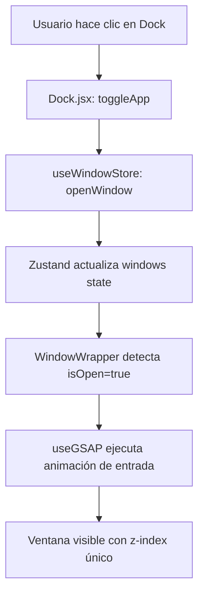
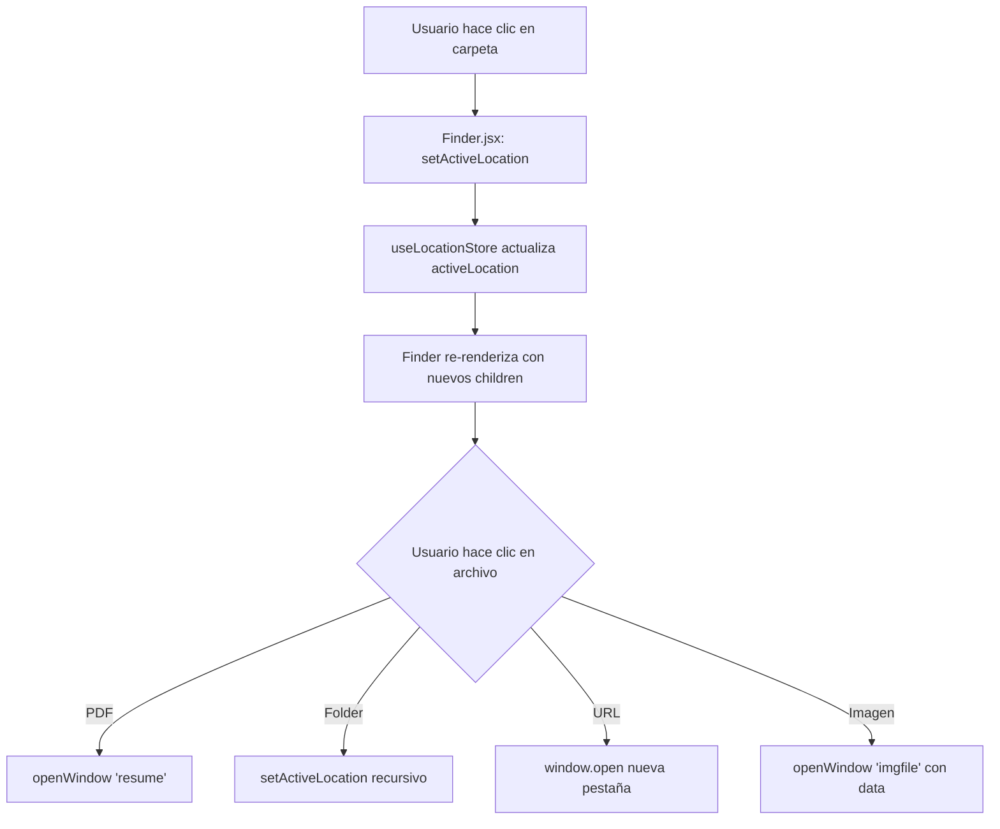
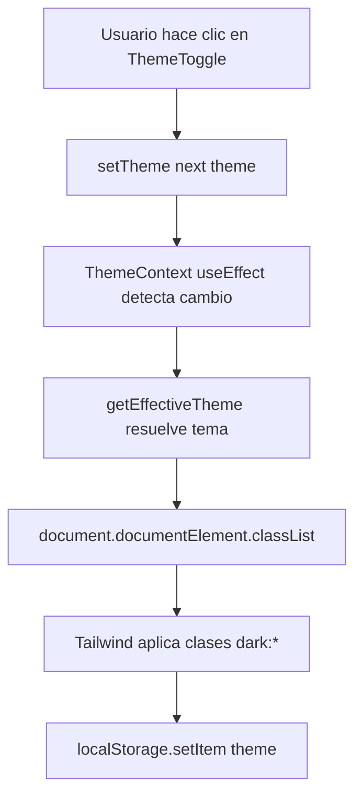

# 🏗️ Arquitectura del Proyecto - macOS Portfolio

> **Documentación técnica completa** del sistema de ventanas, gestión de estado, animaciones y tematización.

---

## 📑 Tabla de Contenidos

1. [Visión General](#-visión-general)
2. [Gestión de Estado con Zustand](#-gestión-de-estado-con-zustand)
   - [Store: window.js](#store-windowjs)
   - [Store: location.js](#store-locationjs)
3. [HOC: WindowWrapper](#-hoc-windowwrapper)
4. [Sistema de Ventanas](#-sistema-de-ventanas)
5. [Animaciones con GSAP](#-animaciones-con-gsap)
6. [Dark Mode con Context API](#-dark-mode-con-context-api)
7. [Arquitectura de Componentes](#-arquitectura-de-componentes)
8. [Flujo de Datos](#-flujo-de-datos)
9. [Responsive Design](#-responsive-design)
10. [Mejores Prácticas Implementadas](#-mejores-prácticas-implementadas)

---

## 🎯 Visión General

Este proyecto es un **portafolio interactivo inspirado en macOS** construido con:

- **React 19** + **Vite** (desarrollo rápido)
- **Zustand** (gestión de estado ligero y sin boilerplate)
- **GSAP** (animaciones fluidas y draggable)
- **Tailwind CSS v4** (estilos utility-first)
- **Context API** (manejo de tema global)

### Características principales:
✅ Sistema de ventanas multi-capa con z-index dinámico  
✅ Drag & Drop solo en desktop (responsive)  
✅ Dark mode con soporte para tema del sistema  
✅ Animaciones suaves con GSAP  
✅ Navegación estilo Finder de macOS  
✅ Componentes reutilizables con HOC pattern  

---

## 🗄️ Gestión de Estado con Zustand

Zustand es una librería de gestión de estado **minimalista y sin Context API**. Es ideal para estados globales pequeños sin la complejidad de Redux.

### Store: `window.js`

**Ubicación:** `src/store/window.js`

Este store controla **todas las ventanas** de la aplicación: apertura, cierre, focus y z-index.

```javascript
import {create} from "zustand";
import {immer} from "zustand/middleware/immer";
import {INITIAL_Z_INDEX, WINDOW_CONFIG} from "#constants/index.js";

const useWindowStore = create(
    immer((set) => ({
        windows: WINDOW_CONFIG,        // Estado inicial de todas las ventanas
        nextZIndex: INITIAL_Z_INDEX + 1, // Contador auto-incremental

        openWindow: (windowKey, data = null) =>
            set((state) => {
                const win = state.windows[windowKey];
                if (!win) return;
                win.isOpen = true;
                win.zIndex = state.nextZIndex;
                win.data = data ?? win.data; // Opcional: pasar datos dinámicos
                state.nextZIndex++;
            }),

        closeWindow: (windowKey) => set((state) => {
            const win = state.windows[windowKey];
            if (!win) return;
            win.isOpen = false;
            win.zIndex = INITIAL_Z_INDEX;
            win.data = null;
        }),

        focusWindow: (windowKey) => set((state) => {
            const win = state.windows[windowKey];
            win.zIndex = state.nextZIndex++; // La ventana se pone al frente
        }),
    })),
);

export default useWindowStore;
```

#### 🔑 Conceptos clave:

1. **Middleware `immer`**: Permite mutar el estado directamente (internamente lo convierte a inmutable).
2. **`WINDOW_CONFIG`**: Objeto con la configuración inicial de cada ventana:
   ```javascript
   {
     finder: { isOpen: false, zIndex: 100, data: null },
     safari: { isOpen: false, zIndex: 100, data: null },
     // ...
   }
   ```
3. **`nextZIndex`**: Contador que asegura que cada ventana abierta tenga un z-index único y creciente.
4. **`data`**: Campo flexible para pasar información dinámica (ej: imagen a mostrar, texto, URL).

#### 📌 Uso en componentes:

```javascript
import useWindowStore from "#store/window.js";

function Dock() {
  const { openWindow, closeWindow, windows } = useWindowStore();
  
  const handleClick = (appId) => {
    const isOpen = windows[appId].isOpen;
    isOpen ? closeWindow(appId) : openWindow(appId);
  };
  
  return (
    <button onClick={() => handleClick('finder')}>
      Open Finder
    </button>
  );
}
```

---

### Store: `location.js`

**Ubicación:** `src/store/location.js`

Este store maneja la **navegación interna del componente Finder** (equivalente al explorador de archivos).

```javascript
import {create} from "zustand";
import {immer} from "zustand/middleware/immer";
import {locations} from "#constants";

const DEFAULT_LOCATION = locations.work;

const useLocationStore = create(
    immer((set) => ({
        activeLocation: DEFAULT_LOCATION,

        setActiveLocation: (location = null) => set((state) => {
            state.activeLocation = location;
        }),

        resetLocation: () => set((state) => {
            state.activeLocation = DEFAULT_LOCATION;
        }),
    })),
);

export default useLocationStore;
```

#### 🔑 Conceptos clave:

1. **`activeLocation`**: Objeto que representa la carpeta o ubicación actual en el Finder.
2. **Estructura de locations** (en `constants/index.js`):
   ```javascript
   {
     id: 1,
     name: "Work",
     icon: "/icons/work.svg",
     kind: "folder",
     children: [
       { id: 5, name: "Proyecto 1", icon: "/images/folder.png", children: [...] },
       // ...
     ]
   }
   ```
3. **Navegación tipo árbol**: Cada ubicación puede tener `children` (sub-carpetas o archivos).

#### 📌 Uso en Finder:

```javascript
import useLocationStore from "#store/location.js";

function Finder() {
  const { activeLocation, setActiveLocation } = useLocationStore();
  
  return (
    <ul>
      {activeLocation?.children?.map((item) => (
        <li key={item.id} onClick={() => setActiveLocation(item)}>
          {item.name}
        </li>
      ))}
    </ul>
  );
}
```

---

## 🎁 HOC: WindowWrapper

**Ubicación:** `src/hoc/WindowWrapper.jsx`

Un **Higher-Order Component (HOC)** que envuelve cualquier ventana y le añade:
- Animación de entrada/salida
- Sistema de drag & drop (solo en desktop)
- Control de z-index
- Visibilidad basada en `isOpen`

```javascript
import { useLayoutEffect, useRef } from "react";
import useWindowStore from "#store/window.js";
import { useGSAP } from "@gsap/react";
import gsap from "gsap";
import { Draggable } from "gsap/Draggable";

const WindowWrapper = (Component, windowKey) => {
  const Wrapped = (props) => {
    const { focusWindow, windows } = useWindowStore();
    const { isOpen, zIndex } = windows[windowKey];
    const ref = useRef(null);

    // 1️⃣ Animación de entrada cuando se abre la ventana
    useGSAP(() => {
      const element = ref.current;
      if (!element || !isOpen) return;

      element.style.display = "block";

      gsap.fromTo(
        element,
        { scale: 0.8, opacity: 0, y: 40 },
        { scale: 1, opacity: 1, y: 0, duration: 0.6, ease: "power3.out" }
      );
    }, [isOpen]);

    // 2️⃣ Draggable SOLO en pantallas grandes con puntero "fino" (mouse/trackpad)
    useGSAP(() => {
      const element = ref.current;
      if (!element) return;

      const mm = gsap.matchMedia();

      // min-width: 768px  -> tablet/desktop
      // pointer: fine     -> dispositivos con ratón / trackpad
      mm.add("(min-width: 768px) and (pointer: fine)", () => {
        const [instance] = Draggable.create(element, {
          dragClickables: true,         // ✅ Permite clics en botones internos
          onPress: () => focusWindow(windowKey),
        });

        // Cleanup cuando deja de aplicar este media query
        return () => {
          if (instance) instance.kill();
        };
      });

      // Cleanup general al desmontar el componente
      return () => mm.revert();
    }, [focusWindow, windowKey]); // ✅ Dependencias correctas

    // 3️⃣ Mostrar/ocultar ventana según isOpen
    useLayoutEffect(() => {
      const element = ref.current;
      if (!element) return;
      element.style.display = isOpen ? "block" : "none";
    }, [isOpen]);

    return (
      <section
        id={windowKey}
        ref={ref}
        style={{ zIndex }}
        className="absolute"
      >
        <Component {...props} />
      </section>
    );
  };

  Wrapped.displayName = `WindowWrapper(${
    Component.displayName || Component.name || "Component"
  })`;

  return Wrapped;
};

export default WindowWrapper;
```

#### 🔑 Conceptos clave:

1. **HOC Pattern**: Función que recibe un componente y devuelve otro componente mejorado.
2. **`useGSAP`**: Hook de GSAP para animaciones con cleanup automático.
3. **`gsap.matchMedia()`**: Aplica comportamientos diferentes según media queries CSS.
4. **`dragClickables: true`**: **Crítico** para que los botones dentro de la ventana funcionen correctamente.
5. **Dependencias de `useGSAP`**: `[focusWindow, windowKey]` previenen closures obsoletos.

#### 📌 Uso:

```javascript
// Ventana normal
function Finder() {
  return <div>Finder Content</div>;
}

// Exportar envuelta con el HOC
const FinderWindow = WindowWrapper(Finder, "finder");
export default FinderWindow;
```

---

## 🪟 Sistema de Ventanas

### Flujo completo:

```
Usuario hace clic en el Dock
        ↓
   openWindow(windowKey)
        ↓
Zustand actualiza: isOpen = true, zIndex = nextZIndex++
        ↓
WindowWrapper detecta cambio de isOpen
        ↓
Ejecuta animación GSAP de entrada
        ↓
Ventana visible con z-index único
        ↓
Usuario puede arrastrar (solo desktop)
        ↓
Al arrastrar/clickear: focusWindow(windowKey)
        ↓
Ventana recibe el z-index más alto (nextZIndex++)
```

### Configuración de ventanas (`constants/index.js`):

```javascript
export const INITIAL_Z_INDEX = 100;

export const WINDOW_CONFIG = {
  finder: { isOpen: false, zIndex: INITIAL_Z_INDEX, data: null },
  safari: { isOpen: false, zIndex: INITIAL_Z_INDEX, data: null },
  terminal: { isOpen: false, zIndex: INITIAL_Z_INDEX, data: null },
  resume: { isOpen: false, zIndex: INITIAL_Z_INDEX, data: null },
  contact: { isOpen: false, zIndex: INITIAL_Z_INDEX, data: null },
  gallery: { isOpen: false, zIndex: INITIAL_Z_INDEX, data: null },
  txtfile: { isOpen: false, zIndex: INITIAL_Z_INDEX, data: null },
  imgfile: { isOpen: false, zIndex: INITIAL_Z_INDEX, data: null },
};
```

### Estructura de una ventana:

```javascript
// 1. Crear el componente
function MyWindow() {
  return (
    <>
      <div id="window-header">
        <WindowControls target="mywindow" />
        <h1>My Window Title</h1>
      </div>
      <div className="content">
        {/* Contenido */}
      </div>
    </>
  );
}

// 2. Envolver con WindowWrapper
const MyWindowWrapped = WindowWrapper(MyWindow, "mywindow");
export default MyWindowWrapped;

// 3. Importar en App.jsx
import MyWindow from "#windows/MyWindow.jsx";

function App() {
  return (
    <main>
      <NavBar />
      <Dock />
      <MyWindow />  {/* Siempre renderizada, pero oculta si isOpen = false */}
    </main>
  );
}
```

---

## 🎨 Animaciones con GSAP

### 1. Animación del Dock (efecto magnification)

**Ubicación:** `src/components/Dock.jsx`

```javascript
useGSAP(() => {
  const dock = dockRef.current;
  if (!dock) return;

  const icons = dock.querySelectorAll(".dock-icon");

  const animateIcons = (mouseX) => {
    const { left } = dock.getBoundingClientRect();

    icons.forEach((icon) => {
      const { left: iconLeft, width } = icon.getBoundingClientRect();
      const center = iconLeft - left + width / 2;
      const distance = Math.abs(mouseX - center);

      // Fórmula exponencial para simular efecto magnético
      const intensity = Math.exp(-(distance ** 2.5) / 20000);

      gsap.to(icon, {
        scale: 1 + 0.25 * intensity,  // Escala máxima 1.25x
        y: -15 * intensity,            // Movimiento vertical máximo 15px
        duration: 0.2,
        ease: "power1.out"
      });
    });
  };

  const handleMouseMove = (e) => {
    const { left } = dock.getBoundingClientRect();
    animateIcons(e.clientX - left);
  };

  const resetIcons = () => {
    icons.forEach((icon) => {
      gsap.to(icon, {
        scale: 1,
        y: 0,
        duration: 0.3,
        ease: "power1.out"
      });
    });
  };

  dock.addEventListener("mousemove", handleMouseMove);
  dock.addEventListener("mouseleave", resetIcons);

  return () => {
    dock.removeEventListener("mousemove", handleMouseMove);
    dock.removeEventListener("mouseleave", resetIcons);
  };
}, []);
```

**Conceptos clave:**
- **Distancia exponencial**: Cuanto más cerca el cursor, mayor la escala.
- **`getBoundingClientRect()`**: Calcula posición exacta del elemento.
- **Cleanup**: Remueve event listeners al desmontar.

### 2. Draggable con Media Queries

```javascript
useGSAP(() => {
  const element = ref.current;
  if (!element) return;

  const mm = gsap.matchMedia();

  mm.add("(min-width: 768px) and (pointer: fine)", () => {
    const [instance] = Draggable.create(element, {
      dragClickables: true,
      onPress: () => focusWindow(windowKey),
    });

    return () => {
      if (instance) instance.kill();
    };
  });

  return () => mm.revert();
}, [focusWindow, windowKey]);
```

**¿Por qué `pointer: fine`?**
- Excluye dispositivos táctiles (tablets, móviles).
- Solo activa drag en dispositivos con mouse/trackpad preciso.
- Evita conflictos con scroll táctil.

### 3. Animación de entrada de ventanas

```javascript
useGSAP(() => {
  const element = ref.current;
  if (!element || !isOpen) return;

  element.style.display = "block";

  gsap.fromTo(
    element,
    { scale: 0.8, opacity: 0, y: 40 },  // Estado inicial
    { scale: 1, opacity: 1, y: 0, duration: 0.6, ease: "power3.out" }  // Estado final
  );
}, [isOpen]);
```

**Efecto visual:**
- La ventana aparece ligeramente más pequeña (0.8), transparente (0) y desplazada hacia abajo (40px).
- Se anima suavemente a su estado normal en 0.6 segundos.

---

## 🌓 Dark Mode con Context API

### Arquitectura:

```
main.jsx
  └── <ThemeProvider>
        └── <App>
              └── Todos los componentes tienen acceso a useTheme()
```

### ThemeContext (`src/context/ThemeContext.jsx`):

```javascript
import { createContext, useContext, useEffect, useState, useMemo, useCallback } from 'react';

const ThemeContext = createContext();

export const ThemeProvider = ({ children }) => {
  // Inicializa desde localStorage o 'system' por defecto
  const [theme, setTheme] = useState(() => {
    const savedTheme = localStorage.getItem('theme');
    return savedTheme || 'system';
  });

  // Resuelve 'system' al tema real del navegador
  const getEffectiveTheme = useCallback(() => {
    if (theme === 'system') {
      return globalThis.matchMedia('(prefers-color-scheme: dark)').matches ? 'dark' : 'light';
    }
    return theme;
  }, [theme]);

  useEffect(() => {
    const root = globalThis.document.documentElement;

    // Remover clases previas
    root.classList.remove('light', 'dark');

    // Aplicar tema efectivo
    const effectiveTheme = getEffectiveTheme();
    root.classList.add(effectiveTheme);

    // Guardar en localStorage
    localStorage.setItem('theme', theme);

    // Listener para cambios en el tema del sistema
    const mediaQuery = globalThis.matchMedia('(prefers-color-scheme: dark)');
    const handleChange = () => {
      if (theme === 'system') {
        root.classList.remove('light', 'dark');
        const newTheme = mediaQuery.matches ? 'dark' : 'light';
        root.classList.add(newTheme);
      }
    };

    mediaQuery.addEventListener('change', handleChange);

    return () => mediaQuery.removeEventListener('change', handleChange);
  }, [theme, getEffectiveTheme]);

  const value = useMemo(() => ({
    theme,              // 'light' | 'dark' | 'system'
    setTheme,
    effectiveTheme: getEffectiveTheme(),  // 'light' | 'dark' (resuelto)
    isDark: getEffectiveTheme() === 'dark',
    isLight: getEffectiveTheme() === 'light',
  }), [theme, getEffectiveTheme]);

  return (
    <ThemeContext.Provider value={value}>
      {children}
    </ThemeContext.Provider>
  );
};

export const useTheme = () => {
  const context = useContext(ThemeContext);
  if (!context) {
    throw new Error('useTheme must be used within ThemeProvider');
  }
  return context;
};
```

**Conceptos clave:**

1. **Tres estados de tema:**
   - `light`: Modo claro forzado
   - `dark`: Modo oscuro forzado
   - `system`: Sigue preferencia del sistema operativo

2. **`getEffectiveTheme()`**: Convierte 'system' al tema real del navegador.

3. **`matchMedia`**: API nativa para detectar preferencias del sistema.

4. **Persistencia**: Usa `localStorage` para recordar la preferencia del usuario.

5. **Clases dinámicas**: Añade `light` o `dark` al `<html>` para que Tailwind aplique estilos.

### ThemeToggle (`src/components/ThemeToggle.jsx`):

```javascript
import { useTheme } from "../context/ThemeContext";
import { Sun, Moon, Monitor } from "lucide-react";

const ThemeToggle = ({ className = "" }) => {
  const { theme, setTheme } = useTheme();

  const getNextTheme = (current) => {
    if (current === "light") return "dark";
    if (current === "dark") return "system";
    return "light"; // Ciclo: light → dark → system → light
  };

  const handleClick = () => {
    const nextTheme = getNextTheme(theme);
    setTheme(nextTheme);
  };

  const getIconAndLabel = () => {
    if (theme === "light") {
      return { Icon: Sun, label: "Cambiar a tema oscuro" };
    }
    if (theme === "dark") {
      return { Icon: Moon, label: "Usar tema del sistema" };
    }
    return { Icon: Monitor, label: "Cambiar a tema claro" };
  };

  const { Icon, label } = getIconAndLabel();

  return (
    <button
      type="button"
      onClick={handleClick}
      aria-label={label}
      className={clsx(
        "h-10 w-10 rounded-full bg-white/50 backdrop-blur-md",
        "hover:bg-white/70 active:scale-90",
        "dark:bg-gray-800/50 dark:hover:bg-gray-700/70",
        "focus:ring-2 focus:ring-blue-500",
        "cursor-pointer touch-manipulation",  // ✅ Permite taps en móvil
        className
      )}
    >
      <Icon className="h-5 w-5 pointer-events-none" />
    </button>
  );
};
```

**Detalles importantes:**

1. **`touch-manipulation`**: Permite taps en móvil y previene double-tap-zoom.
   - ❌ `touch-none`: Bloquearía el clic en móvil.
   - ✅ `touch-manipulation`: Mantiene interactividad táctil.

2. **Ciclo de temas**: El botón rota entre los 3 estados.

3. **Íconos dinámicos**: Usa `lucide-react` para mostrar Sun/Moon/Monitor según el estado.

4. **Accesibilidad**: `aria-label` describe la acción a realizar.

---

## 🏛️ Arquitectura de Componentes

```
src/
├── main.jsx                    # Punto de entrada, envuelve con ThemeProvider
├── App.jsx                     # Componente raíz, renderiza todas las ventanas
├── index.css                   # Estilos globales + Tailwind
│
├── components/                 # Componentes UI reutilizables
│   ├── Dock.jsx               # Barra de apps con animación magnética
│   ├── NavBar.jsx             # Barra superior (links, hora, íconos)
│   ├── ThemeToggle.jsx        # Botón de cambio de tema
│   ├── Welcome.jsx            # Pantalla de bienvenida inicial
│   ├── Home.jsx               # Pantalla de inicio (fondo)
│   └── WindowControls.jsx     # Botones close/minimize/maximize
│
├── windows/                    # Ventanas de la aplicación
│   ├── Finder.jsx             # Explorador de archivos/proyectos
│   ├── Safari.jsx             # Navegador web simulado
│   ├── Terminal.jsx           # Terminal con tech stack
│   ├── Resume.jsx             # Visualizador de PDF (CV)
│   ├── Contact.jsx            # Formulario de contacto
│   ├── Gallery.jsx            # Galería de fotos
│   ├── Text.jsx               # Visor de archivos .txt
│   ├── Image.jsx              # Visor de imágenes
│   └── index.js               # Barrel export
│
├── hoc/                        # Higher-Order Components
│   └── WindowWrapper.jsx      # HOC que añade drag, animación, z-index
│
├── store/                      # Estado global (Zustand)
│   ├── window.js              # Gestión de ventanas (open/close/focus)
│   └── location.js            # Navegación interna de Finder
│
├── context/                    # Context API
│   └── ThemeContext.jsx       # Proveedor de tema light/dark/system
│
└── constants/                  # Configuración estática
    └── index.js               # navLinks, dockApps, WINDOW_CONFIG, locations, etc.
```

---

## 🔄 Flujo de Datos

### 1. Apertura de ventana desde el Dock



### 2. Navegación en Finder



### 3. Cambio de tema



---

## 📱 Responsive Design

### Breakpoints de Tailwind:

```javascript
// Tailwind default breakpoints
sm: 640px   // Tablet pequeña
md: 768px   // Tablet
lg: 1024px  // Desktop
xl: 1280px  // Desktop grande
2xl: 1536px // Desktop ultra
```

### Estrategias implementadas:

#### 1. **Draggable condicional**
```javascript
// Solo en dispositivos con mouse/trackpad
mm.add("(min-width: 768px) and (pointer: fine)", () => {
  Draggable.create(element, { /* ... */ });
});
```

#### 2. **Dock responsive**
```javascript
// Oculta apps menos importantes en móvil
const PINNED_MOBILE_APPS = 5;

{dockApps.map((app, index) => (
  <div className={index >= PINNED_MOBILE_APPS ? "hidden sm:flex" : ""}>
    <button>{app.name}</button>
  </div>
))}
```

#### 3. **Layout de Finder**
```css
/* Mobile: sidebar arriba, contenido abajo (flex-col) */
/* Desktop: sidebar izquierda, contenido derecha (lg:flex-row) */
<div className="flex flex-col lg:flex-row">
  <aside className="sidebar">...</aside>
  <main className="content">...</main>
</div>
```

#### 4. **Tamaño de botones táctiles**
```javascript
// ThemeToggle: área táctil mínima 44x44px en móvil
className="h-10 w-10 md:h-8 md:w-8"
```

#### 5. **Ventanas en móvil**
```css
/* index.css */
@media (max-width: 767px) {
  #finder, #safari, #terminal, #resume {
    position: fixed !important;
    inset: 0;
    width: 100vw;
    height: 100vh;
    border-radius: 0;
  }
}
```

---

## ✅ Mejores Prácticas Implementadas

### 1. **Zustand con Immer**
```javascript
// ✅ Mutación directa (Immer lo convierte a inmutable)
set((state) => {
  state.windows[key].isOpen = true;
});

// ❌ Sin Immer requeriría spread operators anidados
set((state) => ({
  windows: {
    ...state.windows,
    [key]: { ...state.windows[key], isOpen: true }
  }
}));
```

### 2. **HOC con Display Name**
```javascript
Wrapped.displayName = `WindowWrapper(${Component.name})`;
// Ayuda en React DevTools: <WindowWrapper(Finder)> en lugar de <Wrapped>
```

### 3. **Cleanup en useEffect/useGSAP**
```javascript
useGSAP(() => {
  const [instance] = Draggable.create(element, { /* ... */ });
  
  return () => {
    if (instance) instance.kill(); // Libera memoria
  };
}, [deps]);
```

### 4. **Dependencias correctas en hooks**
```javascript
// ✅ Incluye todas las variables externas usadas
useGSAP(() => {
  Draggable.create(element, {
    onPress: () => focusWindow(windowKey),
  });
}, [focusWindow, windowKey]); // Evita closures obsoletos
```

### 5. **Touch-friendly interactions**
```javascript
// ✅ touch-manipulation: permite taps y previene double-tap-zoom
className="touch-manipulation"

// ❌ touch-none: bloquea todos los eventos táctiles
className="touch-none" // Solo usar en overlays no interactivos
```

### 6. **Accesibilidad**
```javascript
<button
  type="button"
  aria-label="Close window"
  aria-pressed={isOpen ? "true" : "false"}
>
  Close
</button>
```

### 7. **Memoización**
```javascript
const value = useMemo(() => ({
  theme,
  setTheme,
  effectiveTheme: getEffectiveTheme(),
}), [theme, getEffectiveTheme]);
// Evita re-renders innecesarios en consumidores del Context
```

### 8. **Barrel exports**
```javascript
// windows/index.js
export { default as Finder } from "./Finder.jsx";
export { default as Safari } from "./Safari.jsx";

// App.jsx
import { Finder, Safari } from "#windows";
```

### 9. **Alias de paths**
```javascript
// vite.config.js
resolve: {
  alias: {
    '#components': '/src/components',
    '#windows': '/src/windows',
    '#store': '/src/store',
    '#constants': '/src/constants',
    '#hoc': '/src/hoc',
  }
}
```

---

## 🚀 Cómo Replicar esta Arquitectura

### 1. Instalar dependencias:
```bash
npm install zustand immer gsap @gsap/react
npm install clsx tailwindcss lucide-react
npm install react-tooltip dayjs react-pdf
```

### 2. Configurar Zustand stores:
```javascript
// src/store/myStore.js
import { create } from "zustand";
import { immer } from "zustand/middleware/immer";

const useMyStore = create(
  immer((set) => ({
    data: null,
    setData: (newData) => set((state) => {
      state.data = newData;
    }),
  }))
);

export default useMyStore;
```

### 3. Crear HOC para ventanas:
```javascript
// src/hoc/WindowWrapper.jsx
const WindowWrapper = (Component, windowKey) => {
  return (props) => {
    const { windows } = useWindowStore();
    const { isOpen, zIndex } = windows[windowKey];
    
    return (
      <section style={{ zIndex, display: isOpen ? 'block' : 'none' }}>
        <Component {...props} />
      </section>
    );
  };
};
```

### 4. Configurar GSAP:
```javascript
// App.jsx
import { Draggable } from "gsap/Draggable";
import gsap from "gsap";
gsap.registerPlugin(Draggable);
```

### 5. Implementar ThemeContext:
```javascript
// main.jsx
import { ThemeProvider } from './context/ThemeContext';

createRoot(document.getElementById('root')).render(
  <ThemeProvider>
    <App />
  </ThemeProvider>
);
```

### 6. Usar Media Queries condicionales:
```javascript
useGSAP(() => {
  const mm = gsap.matchMedia();
  
  mm.add("(min-width: 768px)", () => {
    // Código solo para desktop
  });
  
  return () => mm.revert();
}, [deps]);
```

---

## 📚 Referencias

- [Zustand Docs](https://zustand-demo.pmnd.rs/)
- [GSAP Docs](https://greensock.com/docs/)
- [React Context API](https://react.dev/reference/react/useContext)
- [Tailwind CSS v4](https://tailwindcss.com/)
- [CSS Media Queries Level 4](https://developer.mozilla.org/en-US/docs/Web/CSS/@media)

---

## 🎓 Conclusión

Este proyecto demuestra:

✅ Gestión de estado eficiente con Zustand  
✅ Animaciones fluidas con GSAP  
✅ Responsive design con media queries avanzadas  
✅ Dark mode robusto con Context API  
✅ Patrones avanzados (HOC, barrel exports, cleanup)  
✅ Accesibilidad y UX en dispositivos táctiles  

**Usa este documento como referencia para construir aplicaciones similares con sistemas de ventanas, drag & drop, y tematización avanzada.** 🚀

---

*Última actualización: Diciembre 2025*

